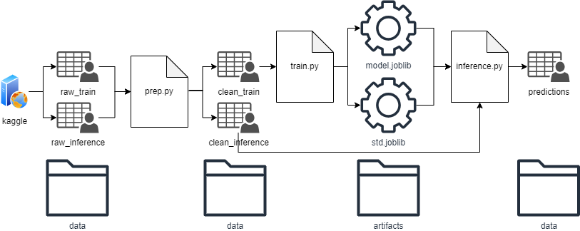

# APD-tarea3
Repositorio sobre la serie de tareas de Arquitectura de Producto de Datos (MGE)

## Objetivo ##
Esta serie de tareas tiene como objetivo entrenar un modelo de regresión lineal para predecir los precios de viviendas utilizando datos proporcionados por la competencia de Kaggle "Housing Prices: Advanced Regression Techniques". El proyecto consta de tres scripts principales: prep.py, train.py e inference.py.

## Dependencias ##
- numpy
- pandas
- matplotlib
- seaborn
- scikit-learn
- joblib

## Estructura ##
La estructura del repositorio es como sigue:

- notebooks: contiene el notebook ipynb original con el modelo completo.

- data: contiene los archivos csv tanto crudos como preparados para entrenar el modelo, así como el archivo de entrada para realizar la inferencia  y el archivo de predicciones de salida.

- artifacts: contiene el modelo entrenado.

- prep.py: Este script descarga los datos de Kaggle, realiza la limpieza y preparación necesaria, y guarda los conjuntos de datos limpios en el directorio data. La entrada del script son datos data/raw. La salida del script son datos clean.

- train.py: Este script carga los datos limpios, entrena un modelo de regresión lineal, evalúa su rendimiento y guarda el modelo entrenado y otros artefactos en el directorio artifacts. La entrada del script son datos data/clean. La salida del script es el modelo entrenado model.joblib

- inference.py: Este script carga el modelo y el escalador entrenados, realiza inferencias en datos de prueba y guarda las predicciones en un archivo CSV en el directorio data. La entrada de este script son datos data/inference y el modelo entrenado model.joblib. La salida de este modelo son predicciones que se guardan en data/predictions.

## Ejecución ##
- Clonar este repositorio
- Descargar los datos de entrenamiento y de test desde https://www.kaggle.com/c/house-prices-advanced-regression-techniques y guardarlos en la carpeta 'data' como raw_train.csv y raw_inference respectivamente.
- Ejecutar los 3 scripts en el siguiente orden: prep.py, train.py, inference.py

## Arquitectura ##

